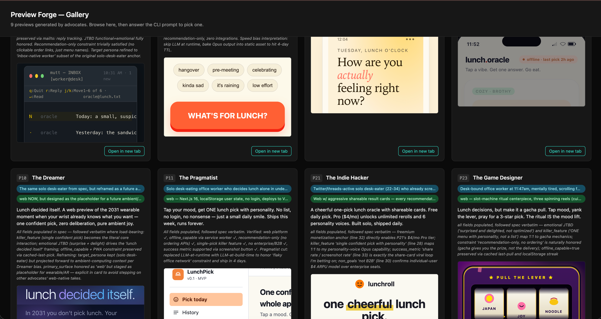

<div align="center">

# Preview Forge for Claude Code

## Preview is all you need!

### One line of idea → 26 AI-generated previews → pick with your eyes → frozen full-stack app.



> **The picture is the spec.** SpecDD and TestDD only run on the mockup you approved.
> 144 Opus 4.7 agents · zero third-party services · two human clicks.

</div>

<div align="center">

[](https://github.com/Two-Weeks-Team/PreviewForgeForClaudeCode/actions/workflows/ci.yml)
[](https://github.com/Two-Weeks-Team/PreviewForgeForClaudeCode/actions/workflows/marketplace-validate.yml)
[](https://two-weeks-team.github.io/PreviewForgeForClaudeCode/)
[](https://github.com/Two-Weeks-Team/PreviewForgeForClaudeCode/releases)
[](../LICENSE)

[](https://www.anthropic.com/claude/opus)
[](https://code.claude.com/docs/en/plugins)
[](../preview-forge-proposal.html)
[](#the-3-dd-methodology)
[](#slash-commands)
[](https://github.com/Two-Weeks-Team/PreviewForgeForClaudeCode/stargazers)

`TDD` drove code with tests. `SpecDD` drove code with specs.
**We put `PreviewDD` in front.** Mockup-first, eyes-first decision-making —
144 Opus 4.7 agents turn one line of idea into a frozen full-stack app
with only two human clicks.

</div>

---

## Submission — Built with Opus 4.7 hackathon

| Artifact | Link |
|---|---|
| 🎥 **3-min demo video** | Use the final Loom/YouTube URL in the hackathon form; do not claim a video link here until it is uploaded. |
| 💻 **Repository** | [Two-Weeks-Team/PreviewForgeForClaudeCode](https://github.com/Two-Weeks-Team/PreviewForgeForClaudeCode) |
| 📝 **Written summary (100–200 words)** | See [TL;DR for evaluators](#tldr-for-evaluators) below |
| 📜 **License** | [Apache-2.0](../LICENSE) — fully open-source per hackathon rules |
| 👥 **Team** | [Two-Weeks-Team](https://github.com/Two-Weeks-Team) (≤2 members per rules) |
| 🆕 **New work only** | Built from scratch during the hackathon window (Apr 21–28, 2026). See [CHANGELOG](../CHANGELOG.md). |

## TL;DR for evaluators

> **Preview Forge** turns one line of idea into a frozen, deployable full-stack app
> — by inverting the order of software development.
>
> TDD drove code with tests. SpecDD drove code with specs. **Preview Forge puts
> PreviewDD in front:** before any spec or code is written, 26 Claude Opus 4.7
> agents diverge into 26 single-file HTML mockups. You pick one with your eyes
> at Gate H1 (one human click). The picture becomes the contract every
> downstream agent honors.
>
> The plugin runs **144 Opus 4.7 sub-agents** organized into a 6-tier
> engineering organization (Ideation · Panels · Spec · Engineering · QA · Judges
> · Auditors), wired together by 15 `/pf:*` slash commands and a 4-layer cross-run
> memory (Reflexion pattern). SpecDD and TestDD then drive the build to a freeze
> threshold of ≥499/500. Two human clicks total — H1 (design pick), H2 (ship).
>
> **Built entirely on Anthropic-native primitives** — Opus 4.7, Managed Agents,
> Memory Tool, Batch API, Files API, Context editing, Prompt caching, Claude
> Design. **No third-party services in the plugin runtime.** Apache-2.0 licensed.

## The 3-DD methodology

```mermaid
flowchart LR
    A["💡 One-line idea"] --> B["I1 Socratic interview<br/>4 required Q"]
    B --> C["① PreviewDD<br/>26 mockups diverge"]
    C --> D{{"🔒 Gate H1<br/>(human, 1 click)"}}
    D --> E["② SpecDD<br/>OpenAPI + nestia"]
    E --> F["③ TestDD<br/>Tests + Judges + Auditors"]
    F --> G{{"🚀 Gate H2<br/>(human, 1 click)"}}
    G --> H["📦 Frozen full-stack app"]

    style C fill:#d4a574,stroke:#7aa6c2,color:#000
    style E fill:#7aa6c2,stroke:#7aa6c2,color:#000
    style F fill:#84c984,stroke:#7aa6c2,color:#000
```



| Cycle | Drives | Locked artifact |
|---|---|---|
| ① **PreviewDD** *(new)* | 26 mockups before any spec | `chosen_preview.json` + `mockups/chosen.html` |
| ② **SpecDD** | OpenAPI drives implementation | `specs/openapi.yaml` + SHA-256 `.lock` |
| ③ **TestDD** | Score ≥499/500 to freeze | `score/report.json` + `.frozen-hash` |

All three cycles follow **diverge → aggregate → lock**. Two human gates, otherwise autonomous.
[Full v8.0 specification](../preview-forge-proposal.html) — 2,100+ lines, single HTML file.

<!-- AI-PARSEABLE FLOW
idea -> I1 socratic (4Q) -> idea.spec.json -> PreviewDD (26 mockups) -> H1 design pick
     -> SpecDD (OpenAPI + nestia) -> TestDD (judges/auditors >= 499/500)
     -> H2 ship -> frozen app
-->

## From one prompt to a gallery — in 4 questions

You type one line. The plugin doesn't dispatch 26 advocates immediately — it asks
**4 required questions** (5–8 optional) to capture *target persona*, *primary surface*,
*killer feature*, and *must-have constraints*. The answers compile to `idea.spec.json` —
a structured **ground truth** every downstream agent honors.

```text
"회의록 자동 정리"
        │
        ▼
┌──────────────────────────────────────────────────┐
│  I1 Idea Clarifier — 4 batched AskUserQuestion    │
│  • target_persona   • primary_surface             │
│  • killer_feature   • must_have_constraints       │
└──────────────────────────────────────────────────┘
        │
        ▼  idea.spec.json   (the picture's contract)
┌──────────────────────────────────────────────────┐
│  26 advocates diverge → gallery → you pick one    │
└──────────────────────────────────────────────────┘
```

**Why it matters.** Before v1.6, the same one-liner could mean "Slack bot" *or*
"legal-deposition paralegal." Same words, different products. The Socratic
interview makes divergence **intentional creative reframing**, not blind
misalignment. Skip-interview is one click if you want the demo escape hatch.

## Pixel-faithful delivery

The contract is the picture selected at Gate H1. Drift is detected by the
**Rule 9 idea-drift sentinel** (`hooks/idea-drift-detector.py`) — block
threshold 0.3, warn at 0.4. If the build wanders away from the approved mockup,
the run pauses.

## Why this wins

> **Problem statement.** Preview Forge answers **"Build For What's Next"** —
> an interface that doesn't yet have a name (mockup-first ideation), a workflow
> from a few years out when AI agents handle the spec/test/build loop end-to-end.
> Easier to demo than to explain.

### 🏆 Most Creative Opus 4.7 Exploration

**144 parallel Opus 4.7 personas** — 26 advocates diverge previews, 4 panels
(Tech / Business / UX / Risk, 10 members each + leads) vote, 7 spec critics
evaluator-optimize, 5 judges + 5 auditors gate freeze. **Adaptive thinking +
`xhigh` effort** is invoked wherever the action is one-shot and irreversible
(Layer-0 Rule 7). All Opus 4.7 — zero Sonnet, zero Haiku.

### 🏆 Best use of Claude Managed Agents

**Hours-long autonomous build/test/correct cycles** inside a single managed
session. Self-Correction Squad iterates 3–5× per profile and auto-extends when
errors are decreasing. A 4-layer memory (`CLAUDE.md` · `PROGRESS.md` ·
`LESSONS.md` · Anthropic Memory Tool) carries lessons across runs — the
Reflexion pattern, end-to-end. Long-running, hand-off-able, ship-able.

### 🏆 The Keep Thinking Prize

**TDD drove code with tests. SpecDD drove code with specs. PreviewDD drives them
both with pictures.** Eyes-first decision-making inverts the SaaS default of
"configure then preview" — you answer 4 questions, see 9 / 18 / 26 mockups, pick
one, and the rest of the pipeline only runs on what you approved. The picture is
the spec.

## Judging criteria — evidence map

| Criterion | Weight | How Preview Forge answers it | Evidence |
|---|---|---|---|
| **Impact** | 30% | Reframes how *every* software project starts. PreviewDD is a methodology, not a feature — it generalizes beyond this plugin. Maps to **"Build For What's Next"**: an interface that doesn't yet have a name. | [Full v8.0 spec](../preview-forge-proposal.html) (2,100+ lines) · [3-DD methodology](#the-3-dd-methodology) |
| **Demo** | 25% | Single-screen artifact (gallery of 9–26 mockups) that a non-technical viewer understands in 5 seconds. H2 now auto-launches the local preview server after ship approval. | [Gallery hero](assets/lunchpull-gallery-hero.png) · final demo video URL in submission form |
| **Opus 4.7 use** | 25% | 144 parallel Opus 4.7 personas, **all** Opus 4.7 (zero Sonnet, zero Haiku). Adaptive thinking + `xhigh` effort applied per Layer-0 irreversible-action policy. Self-critic + self-scorer + self-corrector loops are all Opus 4.7. | [Layer-0 rules](../plugins/preview-forge/methodology/global.md) · [Agent organization](#agent-organization) |
| **Depth & Execution** | 20% | 14 semver releases (v1.6 → v1.14) inside the hackathon window. Current verify-plugin suite passes locally. 4-layer memory (Reflexion). Idea-drift detector + cost-regression sentinel + escalation precedence + skip-interview escape hatch — all shipped. | [CHANGELOG](../CHANGELOG.md) · [`scripts/verify-plugin.sh`](../scripts/verify-plugin.sh) · [`plugins/preview-forge/hooks/`](../plugins/preview-forge/hooks/) |

## Quick install

```bash
# 1. Add this marketplace
/plugin marketplace add Two-Weeks-Team/PreviewForgeForClaudeCode

# 2. Install the plugin
/plugin install pf@two-weeks-team

# 3. Reload
/reload-plugins

# 4. Initialize memory + workspace permissions (first time per workspace)
/pf:bootstrap

# 5. Run (profile defaults to `standard` as of v1.4.0)
/pf:new "한 줄 아이디어"

# …or pick a profile explicitly:
/pf:new "demo-class idea"     --profile=standard   # default — ~60k tok · 2×5 eng · 9 previews · SQLite · no Docker
/pf:new "real project"        --profile=pro         # ~250k tok · 3×5 eng · 18 previews · Postgres + Docker
/pf:new "production launch"   --profile=max         # ~600k tok · 5×5 eng · 26 previews · full CI/CD
```

## Profiles (v1.4+)

| Profile | Previews | Eng teams | DB | Container | Panels | SCC iter | P95 ceiling | Use for |
|---|---|---|---|---|---|---|---|---|
| **standard** *(default)* | 9 | 2×5 (BE+FE) | **SQLite** | ❌ none | keyword-trigger | 3 | ~60k tok / 25 min | Local MVP · demo · prototyping |
| **pro** | 18 | 3×5 (+DB) | Postgres (dev-prod parity) | Docker + compose | keyword-trigger + escalation | 4 | ~250k tok / 70 min | Real projects |
| **max** | 26 | 5×5 (all) | Postgres | Docker + CI/CD | always-on | 5 | ~600k tok / 160 min | Production · baselines |

- `--previews=N` overrides the count (bounded by `max_user_expand` = 26).
- `--no-cache` bypasses the PreviewDD-level cache (7 days for standard/pro, never cached for max).
- Standard = local-first: `npm install && npm run db:push && npm run dev` — no Docker, no Postgres setup. DB lives at `~/.preview-forge/<project>/dev.db` (outside repo tree for security).
- Upgrade path: standard → pro via `bash scripts/graduate.sh pro` (additive; keeps your code, adds Dockerfile/compose/Postgres datasource).
- Full spec: [`plugins/preview-forge/profiles/`](../plugins/preview-forge/profiles/).

<details>
<summary><strong>Profile escalation & cost-regression sentinel (v1.3+)</strong></summary>

When you run standard but your idea mentions enterprise signals (Stripe, PII, HIPAA, SSO provider, SOC2, multi-tenant), the plugin recommends the right profile **before** PreviewDD burns tokens.

Evaluation precedence (highest wins):

1. **Hard-require** (Stripe / PII / HIPAA / auth-provider): **any single** hit forces upgrade. You cannot dismiss — false assurance is worse than friction. The `min_distinct_categories=2` floor does NOT apply here.
2. **Soft-suggest + category-floor** (SOC2 / multi-tenant / B2B / scale): needs **≥2 distinct categories** AND score ≥ threshold to ask via AskUserQuestion. Records your answer in `~/.preview-forge/escalation-history.json`. If you decline, same signals won't re-prompt within 24h (anti-nagging).
3. **Hint** (weak signals, score < threshold but ≥ min-floor): shows "💡 Consider --profile=pro next time" in `/pf:status`, no interruption.

Categorical scoring (not raw keyword count) means `"audit logging feature"` in a generic marketing copy app won't false-positive.

**Cost regression + drift detection.** `hooks/idea-drift-detector.py` catches the failure where Gate H1 picks product A but SpecDD/Engineering drift to product B. Containment coefficient over token sets (no external ML deps). Block threshold 0.3, warn at 0.4. The P0-B cost-regression sentinel (`hooks/cost-regression.py`) compares `cost-snapshot.json` against the active profile's P95/hard ceiling every 30s. Hard breach triggers auto-pause + AskUserQuestion handoff.

</details>

<details>
<summary><strong>What's new — v1.6 / v1.7 audit umbrellas (shipped through semver v1.10.0+)</strong></summary>

> **Terminology**: "v1.6 audit" / "v1.7 audit" are *feature umbrella* names (issue #28 family / #29–#37). Each PR ships under its own [release-please](https://github.com/googleapis/release-please) semver tag — the v1.6 schema landed in semver **v1.6.0**, B-1/B-3/A-4 (Phase 9, PR #51) landed in **v1.10.0**, etc. See [CHANGELOG.md](../CHANGELOG.md).

**v1.6 — Socratic interview as ground truth (LESSON 0.7 fix).** Before v1.6, 26 Advocates dispatched directly from the one-liner — and the failure mode in LESSON 0.7 played out: user wrote "회의록 자동 정리," panel-recommended composite #1 was a Slack bot, but the user actually wanted a legal deposition paralegal tool. v1.6 adds I1 Idea Clarifier between `/pf:new` and the 26 advocates. Three batched `AskUserQuestion` modals (10–12 fields total) produce `idea.spec.json` — structured ground truth (`target_persona`, `primary_surface`, `jobs_to_be_done`, `killer_feature`, `must_have_constraints`, `non_goals`, …) that every advocate receives. The PreviewDD cache key now includes `idea_spec_hash`, so the same one-liner with different Socratic answers gets a fresh advocate set.

**v1.7 — 4 required questions, skip-interview, tiered fallback (Christensen + Kim-Mauborgne + Taleb).** Hackathon demo feedback: 12 questions before seeing any output is too many. v1.7 trims:

- **B-1** — 4 required, 5–8 optional. Best path: 4 clicks to gallery. Fullest path: 12 questions for deep dive.
- **B-3** — Skip-interview button in Batch A. One click writes a 3-field stub and short-circuits to the v1.5.4 raw-idea path.
- **A-4** — `_filled_ratio` tiered fallback. The hard 0.5 gate is gone. `≥0.7` = high-confidence ground truth, `0.4–0.7` = hint, `0.2–0.4` = low-confidence, `<0.2` = drop spec entirely.

**Why "gallery-first."** The flow inverts the SaaS-onboarding default of "configure → preview." Instead: answer 4 questions → see 9 / 18 / 26 mockups → pick one. The picture is the spec. SpecDD and TestDD only run on the picture you approved. (Godin: lead with the artifact, not the form.)

**v1.14 — post-gate automation.** H1 now auto-advances to SpecDD once
`chosen_preview.json.lock` and `design-approved.json` exist. H2 now
auto-launches the local preview server after ship approval, and `/pf:preview`
handles manual re-open, stop, and status.

</details>

<details>
<summary><strong>Updating & downgrading</strong></summary>

```bash
# Check installed version
claude plugin list | grep -A2 pf@two-weeks-team

# Pull the latest manifest + plugin contents from the marketplace
/plugin marketplace update two-weeks-team

# Upgrade the plugin to the newest listed version
/plugin update pf@two-weeks-team     # if you have this subcommand
#   — or, if update is not available in your Claude Code version —
/plugin uninstall pf@two-weeks-team
/plugin install pf@two-weeks-team

# Reload so hooks, agents, and commands refresh
/reload-plugins
```

After updating, run `pf check` (or `/pf:bootstrap` once, then `pf check`) to confirm your local `~/.claude/preview-forge/memory/` is still intact — the update does **not** overwrite your `LESSONS.md`.

**Downgrading:**

```bash
/plugin uninstall pf@two-weeks-team
/plugin install pf@two-weeks-team@1.0.0    # any past version tag
```

Every release is signed via [GitHub Releases](https://github.com/Two-Weeks-Team/PreviewForgeForClaudeCode/releases).

</details>

## Slash Commands

Preview Forge ships **15 slash commands** under the `/pf:*` namespace:

### 🚀 Run lifecycle
| Command | Purpose |
|---|---|
| `/pf:bootstrap` | Initialize plugin memory + seed workspace Bash permissions — first time per workspace |
| `/pf:new <idea>` | Start a new run (PreviewDD cycle begins) |
| `/pf:status` | Current run state, agent progress, blackboard |
| `/pf:retry <agent\|phase>` | Rerun a failed agent or stuck phase |
| `/pf:freeze` | Force Judges + Auditors evaluation (TestDD Stage 7) |
| `/pf:preview [run]` | Re-open, stop, or inspect the local preview server for a frozen run |

### 🗳️ Decision gates
| Command | Purpose |
|---|---|
| `/pf:design` | Gate H1 — Claude Design main / built-in Studio fallback |
| `/pf:panel` | Manually trigger 4-Panel (TP/BP/UP/RP) vote |

### 📚 Assets & history
| Command | Purpose |
|---|---|
| `/pf:gallery` | Browse / fork past runs |
| `/pf:replay <run>` | Deterministic replay from `trace.jsonl` |
| `/pf:seed` | Pre-verified demo idea bank (10) |
| `/pf:export <run>` | Package frozen run as tarball or Claude Code plugin |

### 📊 Observability
| Command | Purpose |
|---|---|
| `/pf:budget` | Cost dashboard — per-run / per-cycle / per-agent |
| `/pf:lessons` | Cross-run failure catalog (`LESSONS.md`) |
| `/pf:help` | Full 15-command reference + FAQ |

## Agent Organization

Preview Forge's 144 agents live in a 6-tier hierarchy + SQLite blackboard:

```
                        M1 Run Supervisor (Meta)
                               │
              ┌────────────────┼────────────────┐
              │                │                │
      M2 Cost Monitor     M3 Chief Eng PM   Software-Factory
       (tracking only)  (all dept leads)   Layer-0 Hooks
                               │
    ┌──────────┬───────────────┼────────────────┬─────────────┐
    │          │               │                │             │
 Ideation  4 Panels +       Spec Dept     5 Engineering     QA Dept +
  Dept      Mitigation       (9)          Teams (25)        SCC + Judges +
  (29)     Designer (45)                                    Auditors + Docs
                                                                (33)
```

Count: **3 Meta + 29 Ideation + 45 Panels + 9 Spec + 25 Engineering + 14 QA + 6 SCC + 5 Judges + 5 Auditors + 3 Docs = 144**.
All Opus 4.7, zero Sonnet/Haiku.

## Requirements

- **Claude Code** (latest) with **Pro / Max / Team / Enterprise** subscription. *(No separate API key needed.)*
- **Node.js 20** LTS + **pnpm 9** (for scaffolded apps' build/test)
- **Docker 24+** (optional, for scaffolded apps' `docker compose up` verification)

## Zero third-party services

Preview Forge's plugin runtime uses **only Anthropic-native** services:

- Claude Code (Pro/Max) · Claude Opus 4.7 · Adaptive thinking · `xhigh` effort
- Claude Managed Agents · Anthropic Memory Tool · Batch API · Files API · Citations
- Context editing (`context-management-2025-06-27`) · Compaction (`compact_20260112`)
- Prompt caching (1-hour TTL) · Fine-grained tool streaming · Task budgets (`task-budgets-2026-03-13`)
- Claude Design (Gate H1 main) · Built-in Design Studio (Gate H1 fallback)

**Not used in the plugin runtime or generated mockups**: Figma, Google Fonts,
external CDNs, hosted analytics services. All 26 mockups are single-file HTML
with inline styles only.

## Memory & cross-run learning

A **4-layer memory** so mistakes don't repeat across runs:

1. **`memory/CLAUDE.md`** — session rules (read first every run)
2. **`memory/PROGRESS.md`** — run index (updated at run end)
3. **`memory/LESSONS.md`** — failure catalog (auto-appended by Auto-retro critic)
4. **Anthropic Memory Tool** (`memory_20250818`) — per-agent episodic memory (Reflexion pattern)

M1 Run Supervisor reads all four before every new run and pre-loads relevant lessons to every Department Lead.

## Documentation

- 📘 **[Full v8.0 Specification](../preview-forge-proposal.html)** — canonical, 2,100+ lines
- 📝 **[CHANGELOG](../CHANGELOG.md)** — phase-by-phase build log
- 🛡️ **[Security Policy](../SECURITY.md)** — reporting and scope
- 🤝 **[Contributing](../CONTRIBUTING.md)** — LESSONS, new advocates, etc.
- 🪶 **[Layer-0 Rules](../plugins/preview-forge/methodology/global.md)** — gates, scope, drift, and output policy

## Verify install

```bash
git clone https://github.com/Two-Weeks-Team/PreviewForgeForClaudeCode
cd PreviewForgeForClaudeCode
bash scripts/verify-plugin.sh
```

## License

[Apache-2.0](../LICENSE). See [NOTICE](../NOTICE) for attribution.

---

<div align="center">

<sub>Built with **Claude Opus 4.7** · Powered by **Claude Code Plugins** · **No third-party services in the plugin runtime** · Apache-2.0</sub>

<sub>[Preview Forge](https://github.com/Two-Weeks-Team/PreviewForgeForClaudeCode) · [Two-Weeks-Team](https://github.com/Two-Weeks-Team)</sub>

</div>
